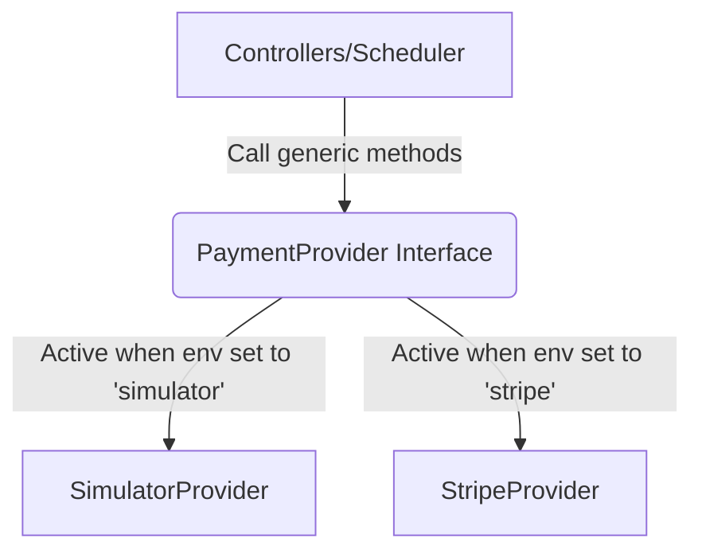

# Payments Integration Guide

This guide details the pluggable payments seam introduced in AppStack. A real payment processor (e.g. Stripe, Braintree) can be integrated by implementing a single interface.

## Seam Architecture

All billing operations are abstracted behind the `PaymentProvider` interface defined in `backend/src/services/payments/types.ts`.



## PaymentProvider Interface

```typescript
export interface PaymentProvider {
  /**
   * Tokenizes card details. Call this during client-side payment method addition.
   */
  tokenizeCard(input: TokenizeCardInput): Promise<TokenizedCard>;

  /**
   * Charges a payment method for subscription checkout, renewal or upgrades.
   */
  charge(input: ChargeInput): Promise<ChargeResult>;

  /**
   * Refunds a charge. Used in buyer refund requests and product deletion overrides.
   */
  refund(input: RefundInput): Promise<RefundResult>;

  /**
   * Disburses funds to a seller. Used in seller payouts.
   */
  disburse(input: DisburseInput): Promise<DisburseResult>;
}
```

## Call Sites

- **Card Tokenization:** `paymentMethodController.ts:createPaymentMethod`
- **Initial Checkout Billing:** `subscriptionController.ts:settleSubscriptionPayment` (for direct checkouts)
- **SaaS Activation Billing:** `integrationController.ts:createSettlementIfMissing` (for webhooks requiring activation)
- **Recurring Renewal Billing:** `scheduler.ts:runBillingCycle` (runs hourly and retries failed payments)
- **Plan Upgrades Pro-rated Charges:** `subscriptionController.ts:changePlan`
- **Approved Payouts Processing:** `scheduler.ts:processApprovedPayouts`
- **Approved Refunds Processing:** `scheduler.ts:processApprovedRefunds`

## Configuration

Set the `PAYMENT_PROVIDER` environment variable in your `.env`:
- `PAYMENT_PROVIDER="simulator"` (Default): Uses the local bank simulator.
- `PAYMENT_PROVIDER="stripe"`: Uses the Stripe integration stub.

## Stripe Integration Checklist

1. **Install SDK:** `npm install stripe`
2. **Setup API Key:** Add `STRIPE_SECRET_KEY` and `NEXT_PUBLIC_STRIPE_PUBLISHABLE_KEY` to environment variables.
3. **Client-side Setup:** Replace card inputs in `frontend/app/buyer/settings/payment-methods/` with Stripe Elements or SetupIntents to tokenize client-side (retaining PCI compliance).
4. **Backend Tokenization:** Update `StripeProvider.tokenizeCard` to retrieve the SetupIntent/PaymentMethod from Stripe and return details.
5. **Implement Charge:** In `StripeProvider.charge`, call `stripe.paymentIntents.create` with `payment_method` set to `providerToken`. Pass `idempotencyKey` to prevent double-charges.
6. **Implement Refund:** In `StripeProvider.refund`, call `stripe.refunds.create` with `charge` ref.
7. **Implement Payout:** In `StripeProvider.disburse`, execute a Stripe Connect transfer/payout to the seller's Stripe Account ID.
8. **Webhook Endpoint:** Setup a Stripe webhook endpoint to listen for asynchronous events (like dispute chargebacks or bank transfer completions).

## Database Reconciliation Columns

The following columns in our Prisma schema store the respective gateway transaction/token identifiers:
- `PaymentMethod.providerToken`: Stores gateway payment method token.
- `Invoice.providerChargeRef`: Stores gateway charge identifier (e.g. `ch_...`).
- `RefundRequest.providerRefundRef`: Stores gateway refund identifier (e.g. `re_...`).
- `PayoutRequest.providerPayoutRef`: Stores gateway payout identifier (e.g. `dp_...`).

## Invoice Retention Policy

AppStack retains financial invoices indefinitely (retaining all logs for at least **5 years** to meet accounting requirements). Future automated database cleanup or archiving scripts must preserve all `Invoice`, `Transaction`, and `Consent` records for a minimum of 5 years from their creation date.
